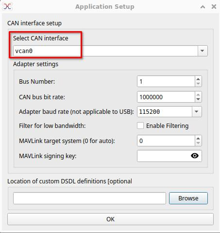

# libcanard examples

These are simple examples of DroneCAN nodes using libcanard and the
dronecan_dsdlc DSDL compiler

For more a more complete firmware framework please see the ArduPilot
AP_Periph firmware framework

## Building Examples

To build each of the examples cd to the subdirectory of the example
and type 'make'

You may need to install the following before building:
```
  sudo pip install empy pydronecan pexpect
```

## Running Examples

The examples can use either socketcan or multicast UDP as the
transport on Linux.

To run with multicast UDP you can start like this:

```
 ./esc_node mcast:0
```

If you want to use socketcan then you need to start socketcan on
Linux. See the setup_socketcan.sh script in this directory for
starting socketcan


After socketcan is setup you can run an example like this:
```
 ./esc_node vcan0
```
Then connect to vcan0 with the DroneCAN GUI Tool.



After starting the GUI tool you need to assign a node ID to the GUI
tool itself by ticking the local node ID selection


For the esc_node and servo_node you will need a dynamic node
allocation server, which you can start within the DroneCAN GUI tool
using the rocket icon in the bottom right corner


This will result in a CAN node ID being allocated and the node showing
up on the bus.


Your new CAN node will now show up in the GUI tool.


